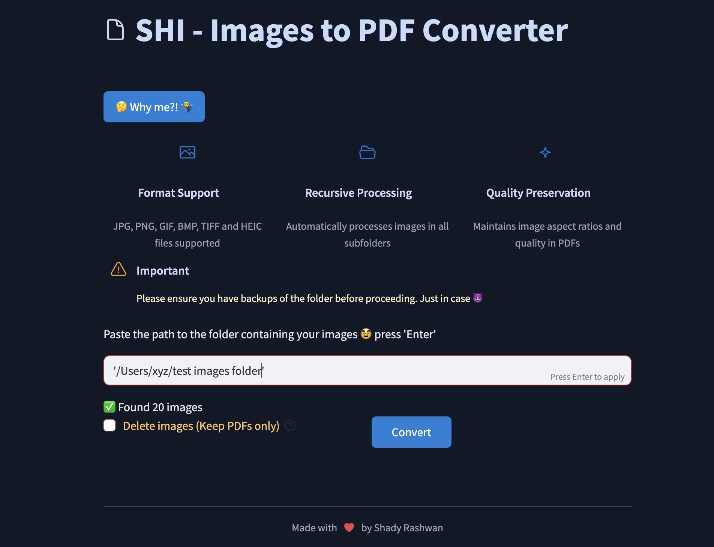
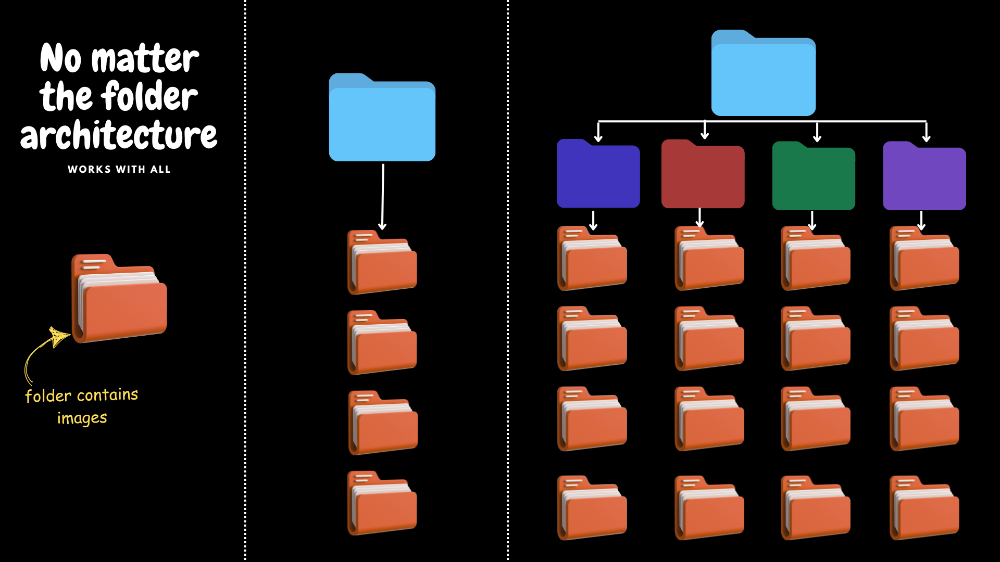

# 📄 SHI - Images to PDF Converter ✨

> Convert your image folders to organized PDFs with just a few clicks! 🪄

SHI is an efficient tool that transforms your image collections into beautifully organized PDFs. It intelligently processes folder structures, preserving organization and quality.



## ✅ Features

- 🖼️ **Multiple Format Support**: JPG, PNG, GIF, BMP, TIFF and HEIC (iOS Photos)
- 📁 **Recursive Processing**: Automatically handles nested folder structures
- 🔍 **Quality Preservation**: Maintains image aspect ratios and quality
- 🌟 **Simple Interface**: Easy-to-use graphical interface for non-technical users
- 💻 **Cross-Platform**: Available for Windows, macOS, and Linux



## 🚀 Installation

### 🪟 Windows

1. Download the latest executable from the [releases page](https://github.com/ShadyRashwan/SHI/releases)
2. Double-click the `.exe` file to install
3. Launch "SHI" from your Start menu
4. No technical knowledge required! 🎉

### 🍎 macOS

#### Option 1: Web UI Tool

```bash
# Clone the repository
git clone https://github.com/yourusername/SHI.git
cd SHI

# Create and activate conda environment
conda env create -f env.yml
conda activate shi

# Run the application with Streamlit interface
streamlit run app/gui.py
```

#### Option 2: Command Line Tool

```bash
# Clone the repository
git clone https://github.com/yourusername/SHI.git
cd SHI

# Create and activate conda environment
conda env create -f env.yml
conda activate shi

# Run the CLI version directly
python app/shi.py
```

## 🛠️ Usage

1. 🚀 Launch the application
2. 📋 Paste the path to the folder containing your images
3. ✓ Choose whether to keep original images after conversion
4. 🔄 Click "Convert"
5. 🎉 Your PDFs will be created in the same folder structure

## 👩‍💻 For Developers

### Project Structure

- `/app`: Core Python application and GUI
- `/desktop-app`: Electron wrapper for desktop distribution


## 💡 Tips & Tricks

- 📱 **iOS Photos**: SHI handles HEIC format natively!
- 🗂️ **Folder Organization**: Create a parent folder with subfolders to generate multiple PDFs
- 🔄 **Batch Processing**: Process hundreds of images in seconds
- 🪄 **Keep it Clean**: Use the delete option to remove original images after conversion

## 📜 License

This project is licensed under the MIT License - see the LICENSE file for details.

## 👏 Acknowledgments

- 🧙‍♂️ Created with ❤️ by Shady Rashwan
- 🎨 Icons from [FontAwesome](https://fontawesome.com)
