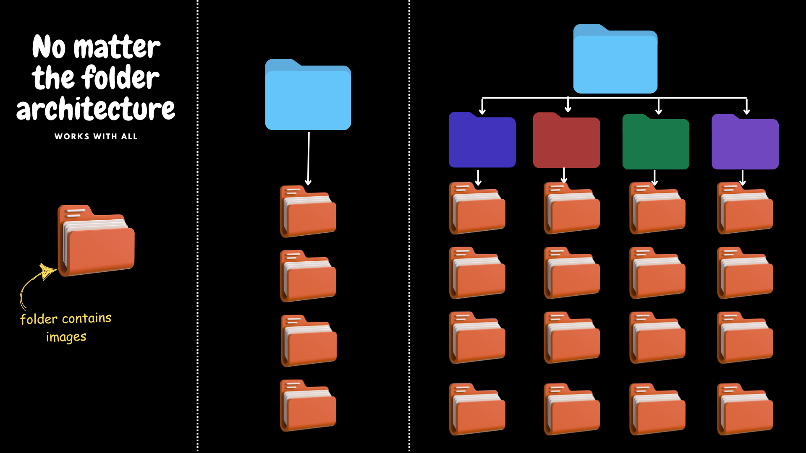

# SHI - Images to PDF Converter

## 📋 Overview

   SHI is a powerful utility that converts images in folders and subfolders to PDF documents. It's designed to help you organize and archive your image collections efficiently by creating a consolidated PDF file for each folder of images.


```
╔══════════════════════════════════════════════════════════════════╗
║                                                                  ║
║                          ███████╗██╗  ██╗██╗                     ║
║                          ██╔════╝██║  ██║██║                     ║
║                          ███████╗███████║██║                     ║
║                          ╚════██║██╔══██║██║                     ║
║                          ███████║██║  ██║██║                     ║
║                          ╚══════╝╚═╝  ╚═╝╚═╝                     ║
║                                                                  ║
║                                                                  ║
║                                                                  ║
╚══════════════════════════════════════════════════════════════════╝
```

## ✨ Features

- **Comprehensive Format Support**: Handles all common image formats (JPG, PNG, GIF, BMP, TIFF) and even Apple HEIC files
- **Recursive Processing**: Automatically processes images in subfolders
- **Aspect Ratio Preservation**: Maintains image proportions in the generated PDF
- **Progress Tracking**: Visual progress bars during processing
- **Option to Preserve Originals**: Choose whether to keep or delete original images
- **Clean User Interface**: Simple interactive command-line interface

## 📊 How It Works

Input a folder path, the tool will process it and process sub-folders if any.




## 🚀 Installation (Detailed Guide)

SHI requires **Python 3.6+**. You can install dependencies using **Conda**, **pip**, or a **Python virtual environment (`venv`)**. Choose the method that works best for you.

### 🪟 Windows Installation

#### Installing Conda (Miniconda) on Windows
1. Download the installer from [Miniconda website](https://docs.conda.io/en/latest/miniconda.html)
2. Run the downloaded .exe file and follow the installation instructions
3. During installation:
   - Install for "Just Me" (recommended)
   - Choose the default installation location
   - Check "Add Miniconda to my PATH environment variable"
   - Check "Register Miniconda as my default Python"
4. Open a new Command Prompt to start using Conda

#### Setting Up SHI on Windows
1. Open Command Prompt
   - Press `Win + R`, type `cmd`, and press **Enter**.

2. Install Git (if not already installed)
   - Download from [https://git-scm.com](https://git-scm.com) and install (default options are fine).
   - After installation, reopen Command Prompt.

3. Clone the repository
   ```cmd
   git clone https://github.com/username/SHI.git
   cd SHI
   ```

4. Choose one of the following setup options:

   ##### 👉 Option A: Using Conda (Recommended)
   ```cmd
   conda env create -f env.yml
   conda activate shi
   ```

   ##### 👉 Option B: Using Python Virtual Environment (`venv`)
   ```cmd
   python -m venv venv
   venv\Scripts\activate
   pip install -r requirements.txt
   ```

   ##### 👉 Option C: Using pip (No virtual environment)
   ```cmd
   pip install -r requirements.txt
   ```

#### Running SHI on Windows
1. Run the Python script:
   ```cmd
   python  medical.py
   ```

### 🐧 Mac / Linux Installation

#### Installing Conda (Miniconda) on Mac/Linux
1. Download the installer:
   ```bash
   # For macOS
   wget https://repo.anaconda.com/miniconda/Miniconda3-latest-MacOSX-x86_64.sh -O ~/miniconda.sh
   # For Linux
   wget https://repo.anaconda.com/miniconda/Miniconda3-latest-Linux-x86_64.sh -O ~/miniconda.sh
   ```

2. Install Miniconda:
   ```bash
   bash ~/miniconda.sh -b -p $HOME/miniconda
   ```

3. Initialize Conda:
   ```bash
   $HOME/miniconda/bin/conda init bash
   $HOME/miniconda/bin/conda init zsh  # If you use zsh
   ```

4. Close and reopen your terminal or run:
   ```bash
   source ~/.bashrc  # or source ~/.zshrc for zsh
   ```

#### Setting Up SHI on Mac/Linux
1. Open Terminal
   - Go to `Applications > Utilities > Terminal` or press `Cmd + Space` and search for **Terminal**.

2. Clone the repository
   ```bash
   git clone https://github.com/username/SHI.git
   cd SHI
   ```

3. Choose one of the following setup options:

   ##### 👉 Option A: Using Conda (Recommended)
   ```bash
   conda env create -f env.yml
   conda activate shi
   ```

   ##### 👉 Option B: Using Python Virtual Environment (`venv`)
   ```bash
   python3 -m venv venv
   source venv/bin/activate
   pip install -r requirements.txt
   ```

   ##### 👉 Option C: Using pip (No virtual environment)
   ```bash
   pip install -r requirements.txt
   ```

#### Running SHI on Mac/Linux
1. Open Terminal.
2. Navigate to the SHI directory:
   ```bash
   python medical.py
   ```

## 💻 Usage

Once you've completed the installation, follow these steps to use SHI:

### Usage Instructions
1. When prompted, enter the full path to the parent folder.
   - Example: `C:\Users\YourUsername\medical-claims` (Windows)
   - Example: `/Users/YourUsername/medical-claims` (Mac/Linux)
2. Choose whether to preserve original images or delete them after PDF creation.
3. The tool will process all images in the folder and its subfolders.
4. PDFs will be created in each folder, named after the folder.

## 📊 Supported Image Formats

| Format | Extension | Support |
|--------|-----------|---------|
| JPEG   | .jpg, .jpeg | ✅ |
| PNG    | .png      | ✅ |
| GIF    | .gif      | ✅ |
| BMP    | .bmp      | ✅ |
| TIFF   | .tiff, .tif | ✅ |
| HEIC   | .heic     | ✅ (auto-converts to PNG) |

## ⚠️ Important Notes

- By default, original images will be deleted after processing
- Make a backup of your images if needed before running the tool
- The tool creates one PDF per folder, named after the folder

## 🤝 Contributing

Contributions are welcome! Please feel free to submit a Pull Request.

## 📜 License

This project is licensed under the MIT License - see the LICENSE file for details.

## 👤 Author

Made with ❤️ by Shady Rashwan
- Created: March 12, 2023

---